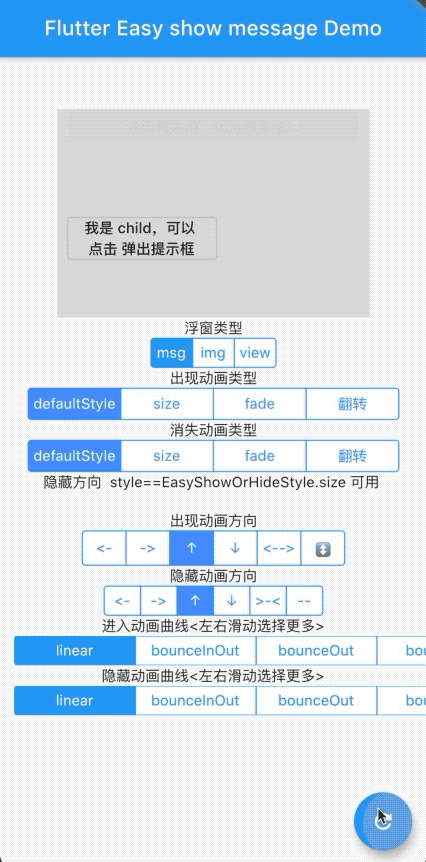

# flutter_transition_animation
🔥🔥🔥可配置的动画转场，用来展示顶部提示信息更香哦

## 效果


## 如何使用

## 动画步骤

动画进入可以定制进入的时间，动画规则，和动画的方向。

|动画方向|含义|
|:-:|:-:|
|rtl| 右到左|
|ltr|左到右|
|ttb| 顶部到底部|
|btt|底部到顶部|
|thv|水平合并到一条线|
|tvc|竖直合成到一条线|

|动画规则|含义|
|:-:|:-:|
|easy| 渐隐渐显|
|easIn| 缓慢进入|
|line|匀速|
...
更多规则见: [animation](https://api.flutter.dev/flutter/animation/Curves-class.html)

|时间属性|含义|
|:-:|:-:|
|duration| 动画停留时间|
|showDuration| 动画从没有到完全展示时间|
|hideDuration| 动画消失使用的时间|


## 执行动画


> 只需要设定不一样的key即可。


## examaple

```dart

Container(
  height: 200,
  width: 300,
  color: Colors.black12,
  /// 每次刷新给不同 key 可以执行动画
  key: UniqueKey(),
  alignment: Alignment.topCenter,
  child: Container(
    width: 200,
    height: 250,
    child: FlutterEasyMessage(
      child: child,
      messageChild: messageChild,
      duration: Duration(seconds: 2),
      hideAnimationStyle: dismissStyle,
      showAnimationStyle: style,
      showAnimaitonDirection: showFlipStyle,
      hideAnimaitonDirection: hideFlipStyle,
      hideDuration: Duration(seconds: 1),
      showDuration: Duration(seconds: 1),
      curve: _showCurve,
      reverseCurve: _hideCurve,
    ),
  ),
)
```

> [查看完整例子]( ./example)


## 详细属性

```dart
/// 主体 部件
  final Widget child;

  /// 展示 动画的部件
  final Widget messageChild;

  /// 动画停留时间展示时间默认 [1000ms]
  final Duration duration;

  /// 展示动画时间 默认 [300ms]
  final Duration showDuration;

  /// 隐藏动画时间 默认 [300ms]
  final Duration hideDuration;

  /// 动画出现类别 默认是[EasyShowOrHideStyle.defaultStyle]
  final EasyShowOrHideStyle showAnimationStyle;

  /// 动画消失类别 默认是[EasyShowOrHideStyle.defaultStyle]
  final EasyShowOrHideStyle hideAnimationStyle;

  /// 动画出现时候的方向，默认是[EasyAnimaitonDirection.ltr]
  final EasyAnimationDirection showAnimaitonDirection;

  /// 动画隐藏时候的方向,默认是[EasyAnimaitonDirection.btt]
  final EasyAnimationDirection hideAnimaitonDirection;

  /// 进入的时候的规则,默认是[Curves.linear] [https://api.flutter.dev/flutter/animation/Curves-class.html]
  final Curve curve;

  /// 返回时候 规则,默认是[Curves.linear][https://api.flutter.dev/flutter/animation/Curves-class.html]
  final Curve reverseCurve;
```


## 喜欢就留下你的✨✨

## [License](LICENSE)